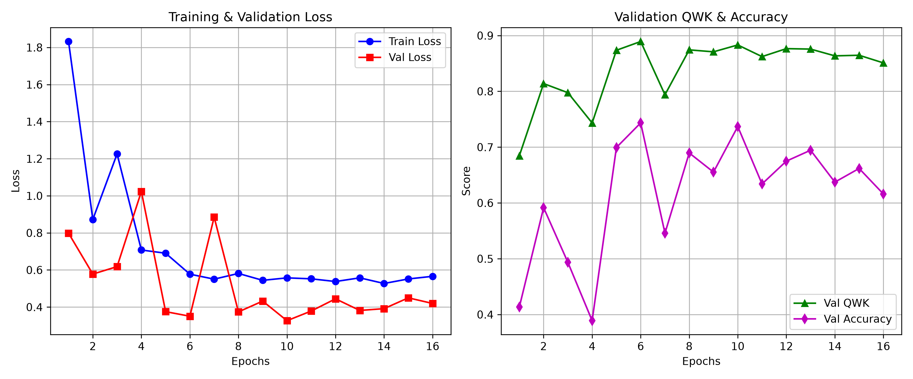
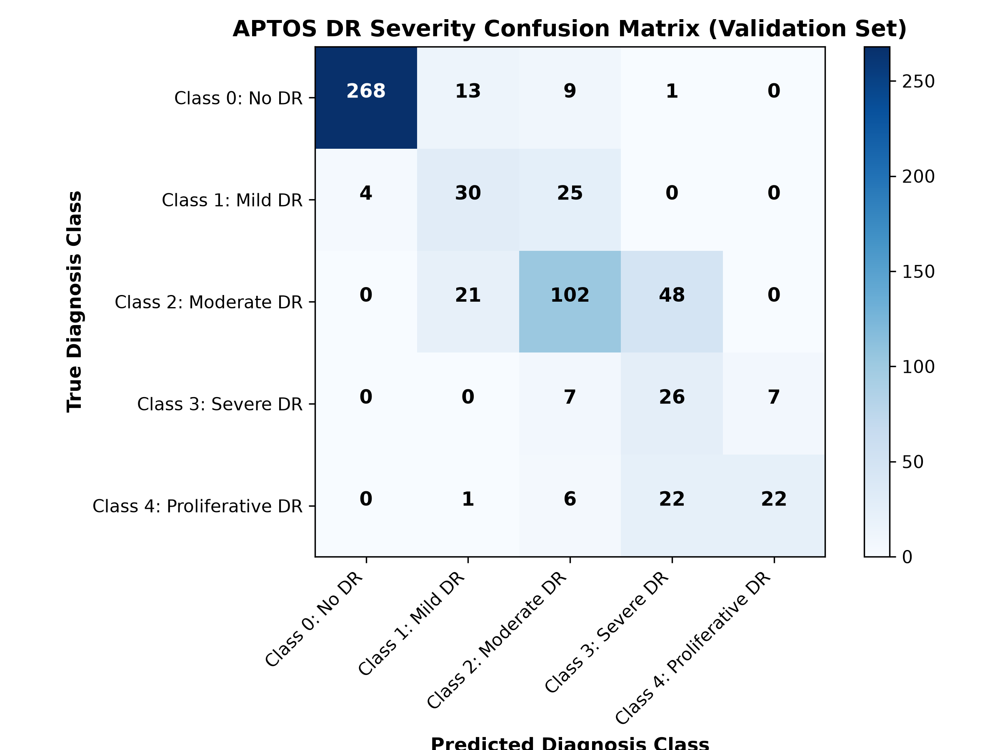
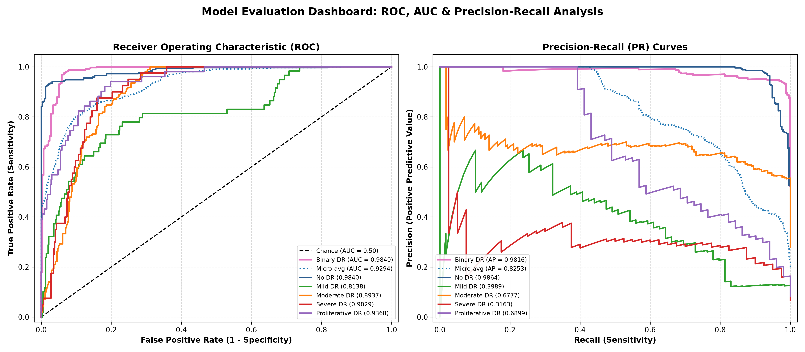
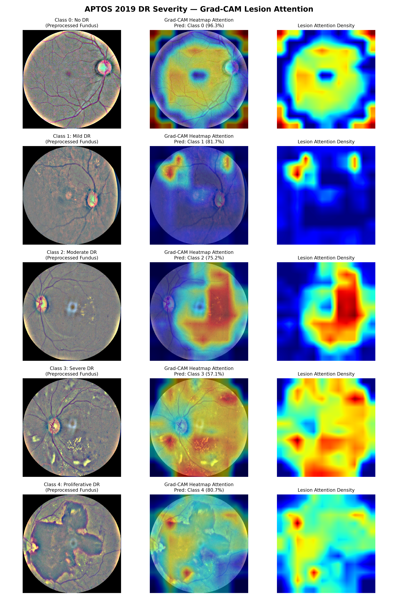
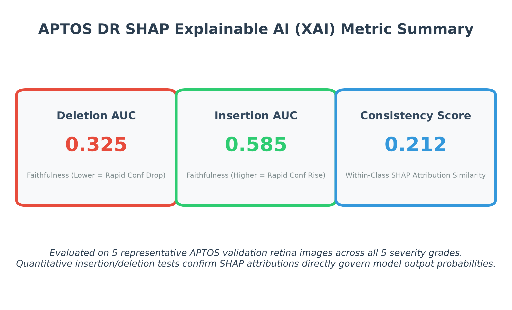
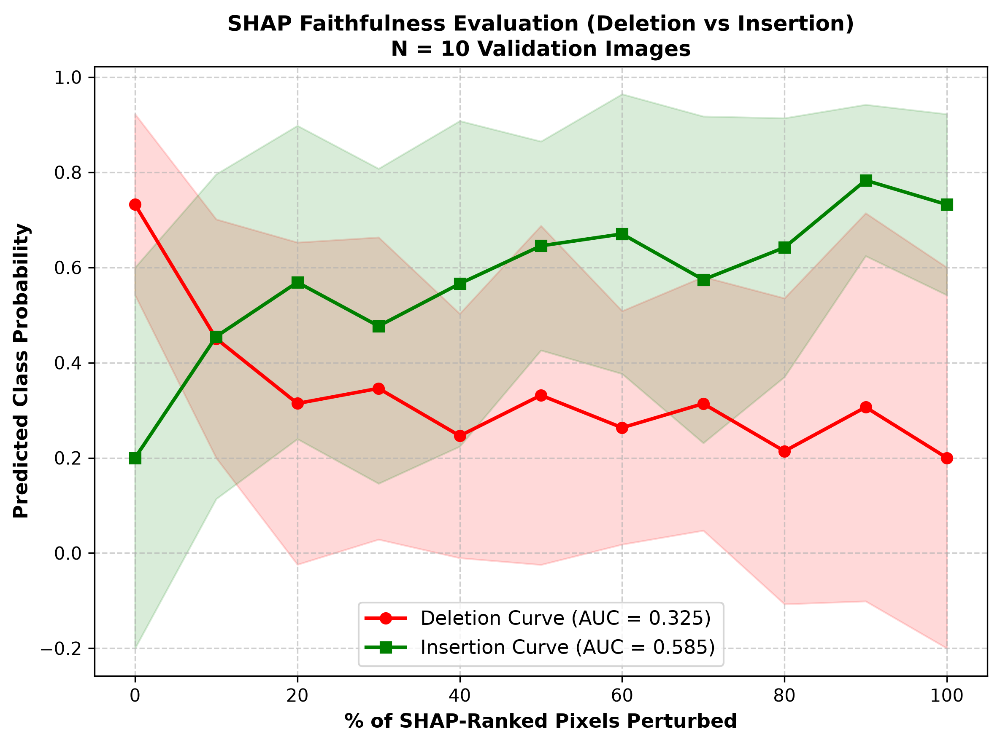

# NethraAI — Diabetic Retinopathy Severity Detection (APTOS 2019)

> **SIH Implementation** — AI-Driven Diabetic Retinopathy (DR) Severity Classification & Explainability System using Swin Transformers, Quadratic Weighted Kappa (QWK) tracking, and Grad-CAM Attention Heatmaps.

---

## 📌 Project Overview

Diabetic Retinopathy (DR) is a leading cause of blindness worldwide among working-age adults. Early detection via retinal fundus photography is critical to preventing severe visual loss.

This repository implements a deep learning pipeline optimized for the **APTOS 2019 Blindness Detection** dataset:
- **5-Class Severity Classification**:
  - `0`: No DR
  - `1`: Mild DR
  - `2`: Moderate DR
  - `3`: Severe DR
  - `4`: Proliferative DR
- **Evaluation Metric**: Quadratic Weighted Kappa (QWK), matching Kaggle competition and clinical evaluation standards.
- **Hardware Optimization**: Built and tested for NVIDIA RTX 4050 (6GB VRAM) with Automatic Mixed Precision (`torch.amp`).
- **Clinical Explainability**: Integrated Grad-CAM++ visualizations to highlight microaneurysms, hemorrhages, and exudate lesion regions.

---

## 🛠 Tech Stack

- **Python**: 3.10 / 3.11
- **Deep Learning**: PyTorch 2.x, `timm` (Swin Transformer / EfficientNet backbones)
- **Data Augmentation**: `albumentations`
- **Image Preprocessing**: OpenCV (`cv2`) with Ben Graham contrast enhancement & circular masking
- **Explainability**: `pytorch-grad-cam`
- **Metrics & Analysis**: `scikit-learn`, `pandas`, `numpy`, `matplotlib`

---

## 📂 Repository Structure

```
d:/SIH/
├── config.py                 # Central configuration (paths, hyperparameters, hardware)
├── preprocess.py             # Ben Graham fundus cropping, masking, and contrast enhancement
├── dataset.py                # Stratified split, Albumentations pipeline, pre-caching DataLoader
├── model.py                  # Swin-Tiny & EfficientNet-B3 architectures with head freezing helpers
├── train.py                  # Training loop with AMP, AdamW, Cosine Annealing & QWK checkpointing
├── evaluate.py               # Test-Time Augmentation (TTA), QWK score, confusion matrix export
├── gradcam.py                # Grad-CAM++ lesion attention maps for 5 DR classes
├── infer.py                  # Single-image inference API & CLI interface
├── eda.ipynb                 # Exploratory Data Analysis & preprocessing inspection
├── checkpoints/              # Saved PyTorch model weights (best_model.pth)
├── outputs/                  # Training curves, confusion matrix, Grad-CAM overlays
├── requirements.txt          # Pinned Python package dependencies
└── README.md                 # Documentation
```

---

## 🚀 Quick Start Guide

### 1. Environment Setup

Clone the repository and install requirements in your Python virtual environment:

```bash
# Create and activate virtual environment
python -m venv .venv
.venv\Scripts\activate

# Install dependencies
pip install -r requirements.txt
```

### 2. Dataset Preparation

Place your APTOS 2019 dataset inside `data/`:
- `data/train.csv` (Columns: `id_code`, `diagnosis`)
- `data/train_images/` (Raw `.png` fundus images)

*Note: If no dataset is detected, the pipeline automatically generates synthetic fundus images to allow seamless execution and testing out of the box.*

### 3. Pipeline Execution Workflow

#### Step 1: Preprocessing & Data Verification
```bash
python preprocess.py
```
Applies Ben Graham color subtraction and border cropping, caching processed images in `data/processed/`.

#### Step 2: Model Training
```bash
python train.py
```
- Trains Swin-Tiny backbone for 25 epochs (with 2-epoch head warmup).
- Tracks Val QWK score.
- Saves best checkpoint to `checkpoints/best_model.pth`.
- Exports training loss & QWK curves to `outputs/training_curves.png`.

#### Step 3: Model Evaluation & Test-Time Augmentation (TTA)
```bash
python evaluate.py
```
- Computes overall QWK metric on validation set.
- Generates classification report and confusion matrix plot (`outputs/confusion_matrix.png`).
- Analyzes adjacent-class misclassification rates.

#### Step 4: Explainability & Grad-CAM Visualizations
```bash
python gradcam.py
```
- Generates Grad-CAM++ heatmaps highlighting microaneurysms, exudates, and hemorrhages.
- Exports visual samples for all 5 classes to `outputs/gradcam_examples/`.

#### Step 5: Single-Image Inference
```bash
python infer.py --image path/to/retina_image.png
```
Returns predicted severity class, clinical diagnosis label, and confidence probabilities.

---

## 📊 Key Results & Performance Showcase

| Metric / Feature | Implementation Detail |
|---|---|
| **Primary Metric** | Quadratic Weighted Kappa (QWK) |
| **Model Architecture** | Swin Transformer Tiny (`swin_tiny_patch4_window7_224`) |
| **Inference Boost** | 3-View Test-Time Augmentation (TTA) |
| **Explainability** | Grad-CAM++ with Swin spatial token reshape transform & SHAP |
| **Target Hardware** | NVIDIA RTX 4050 Laptop GPU (6GB VRAM, AMP Mixed Precision) |

---

## 📈 Model Performance & Evaluation Graphs

### 1. Training & Validation Progress
The model tracks loss convergence and Quadratic Weighted Kappa (QWK) score across all epochs:



### 2. 5-Class Confusion Matrix
Comprehensive breakdown of predictions across all DR severity levels (Class 0: No DR to Class 4: Proliferative DR):



### 3. ROC & Precision-Recall Curves
Per-class Receiver Operating Characteristic (ROC) and Precision-Recall (PR) curves evaluating diagnostic accuracy:



---

## 🔍 Explainable AI (XAI) & Lesion Localization

### 1. Grad-CAM++ Attention Maps
Visual explanation of key retinal regions (microaneurysms, hemorrhages, and exudates) influencing predictions across DR severity levels:



### 2. SHAP Feature Importance & Faithfulness Evaluation
Global feature attribution analysis via SHAP alongside deletion/insertion curve evaluation for heatmap faithfulness:

| SHAP Feature Summary | Deletion & Insertion Curves |
|:---:|:---:|
|  |  |

---

## 📝 License

Developed for SIH Hackathon — APTOS 2019 Diabetic Retinopathy Blindness Detection Phase.

