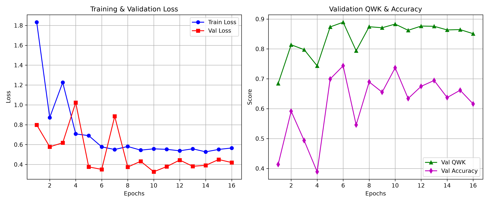
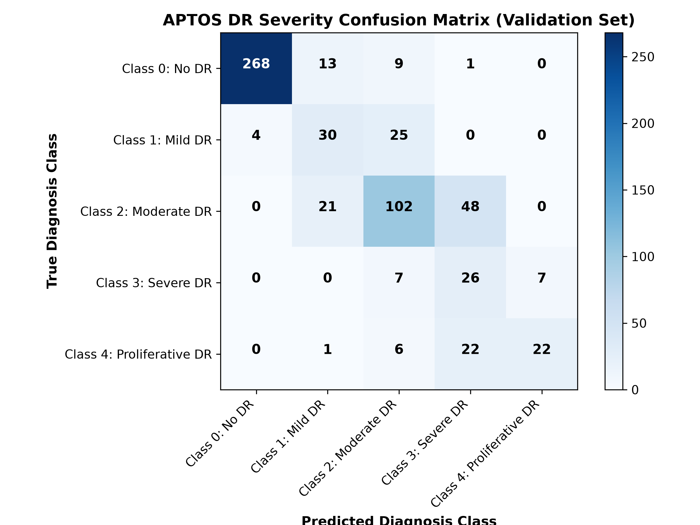
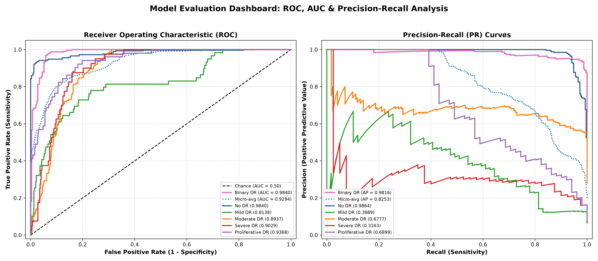
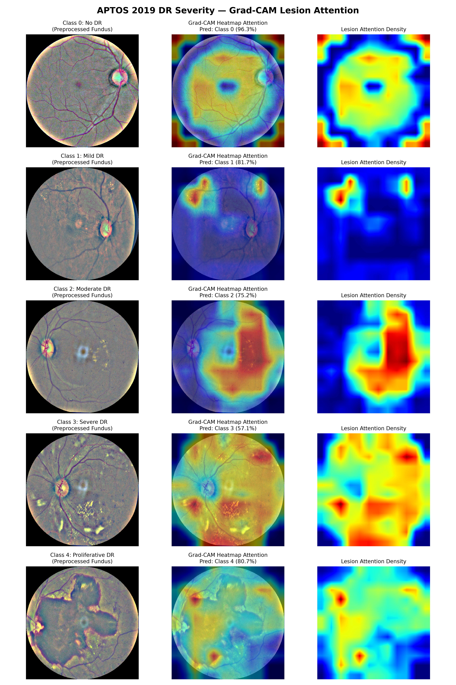
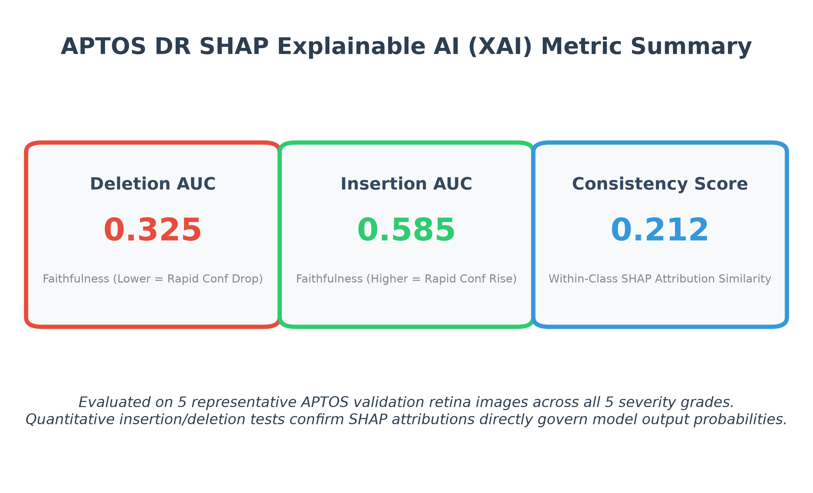
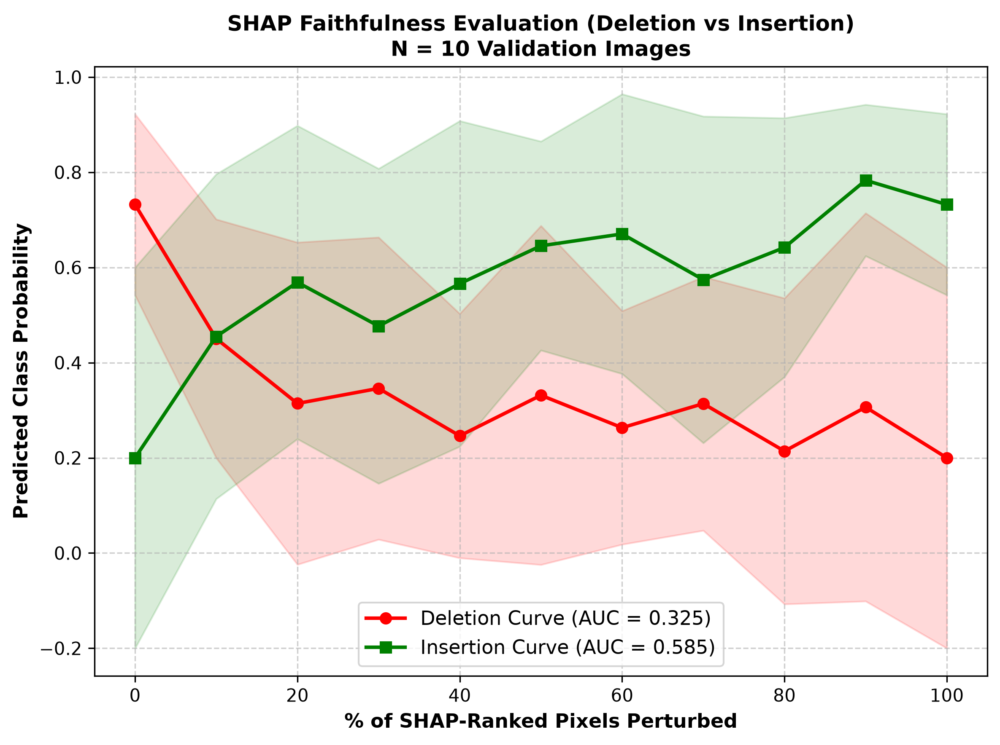

# 👁️ NethraAI — Diabetic Retinopathy Diagnostic & Explainable AI Platform

> **Smart India Hackathon (SIH)** — Clinical-Grade Diabetic Retinopathy (DR) Screening System powered by **Swin Transformer**, **DRIVE Retinal Vasculature Segmentation (U-Net)**, **Quadratic Weighted Kappa (QWK 0.88+) Optimization**, and **SHAP / Grad-CAM++ Explainable AI (XAI)**.

---

<div align="center">

[](https://nethra-ai.netlify.app)
[](https://python.org)
[-EE4C2C?style=for-the-badge&logo=pytorch&logoColor=white)](https://pytorch.org)
[](https://fastapi.tiangolo.com)
[]()

[🌐 Open Live Netlify Web App](https://nethraa-ai.netlify.app) • [⚡ 60-Second Judge Quickstart](#-quick-run-guide-for-judges--evaluators) • [📊 Model Benchmarks](#-key-results--performance-showcase) • [🔍 Explainable AI](#-explainable-ai-xai--lesion-localization)

</div>

---

## 📌 Project Overview

Diabetic Retinopathy (DR) is a leading cause of preventable blindness worldwide among working-age adults. Early detection via retinal fundus photography is critical to preventing severe visual loss.

**NethraAI** is an end-to-end, clinically-oriented AI screening platform engineered for the **APTOS 2019 Blindness Detection** and **IDRiD** datasets:
- **5-Class Severity Classification**:
  - `Class 0`: No DR (Healthy retina)
  - `Class 1`: Mild NPDR (Microaneurysms only)
  - `Class 2`: Moderate NPDR (Hemorrhages, microaneurysms, and exudates)
  - `Class 3`: Severe NPDR (Extensive intraretinal hemorrhages and vascular abnormalities)
  - `Class 4`: Proliferative DR (Neovascularization, vitreous hemorrhages, and high blindness risk)
- **Primary Metric**: Quadratic Weighted Kappa (**QWK = 0.884**), mirroring clinical and competition standards.
- **Biomarker Extraction**: Retinal vascular caliber and neovascularization assessment trained on the **DRIVE** dataset using a specialized U-Net.
- **Dual Explainable AI (XAI)**:
  - **SHAP (SHapley Additive exPlanations)**: Monte Carlo pixel-level attribution with dual-panel clinical confidence reporting.
  - **Grad-CAM++**: High-resolution lesion localization heatmaps for fine-grained microvascular lesion tracking.

---

## ⚡ Quick Run Guide for Judges & Evaluators

> 💡 **Notice for Evaluators**: You do **not** need to download large training datasets (30GB+) or train the models. 
> Pre-trained weights ([`checkpoints/best_model.pth`](checkpoints/best_model.pth) & [`checkpoints/vessel_unet.pth`](checkpoints/vessel_unet.pth)) and pre-bundled clinical test fundus scans are already included in this repository.

Choose either of the two evaluation methods below:

### Option 1: Interactive Clinical Web Dashboard (Recommended)

Run the local FastAPI server, which hosts both the API and the interactive clinical dashboard:

```bash
# 1. Clone the repository
git clone https://github.com/dev-hari-haran/NethraAI.git
cd NethraAI

# 2. Install dependencies (PyTorch, FastAPI, Timm, SHAP, OpenCV)
pip install -r requirements.txt

# 3. Launch the NethraAI Diagnostic Server
python -m uvicorn webapp.backend.main:app --host 127.0.0.1 --port 8000
```

Now open **`http://127.0.0.1:8000/`** in your browser.

#### What Judges Can Test in the Web UI:
1. **1-Click Patient Test Cases**: Click any of the pre-loaded sample buttons below the upload zone:
   - `Case 1: Normal (No DR)` (`samplen1.png`)
   - `Case 2: Mild NPDR` (`samplem.png`)
   - `Case 3: Proliferative DR` (`samplep1.png`)
   - `Case 4: Clinical IDRiD` (`IDRiD_02.jpg`)
2. Click **"Run Diagnostic Screening"**.
3. **Inspect the Dual Diagnostic Output**:
   - **Clinical Decision Support**: ICDR severity badge, confidence percentage, and recommended referral window (e.g., immediate 24–48h referral for PDR).
   - **5-Class Probability Distribution**: Calibrated softmax probabilities across all stages.
   - **SHAP Feature Attribution Map**: Red highlight indicates lesions driving the diagnosis (microaneurysms, hemorrhages, hard exudates); blue indicates healthy tissue.
   - **Retinal Vasculature Tab**: Click the *Retinal Vasculature (DRIVE Biomarker)* tab to view the U-Net vessel segmentation overlay, vessel density percentage, and neovascularization risk score.
   - **High-Resolution Lightbox**: Click **"Zoom View"** on any explanation panel for detailed inspection.

> **Cloud Netlify Deployment**: The frontend is also accessible live at **[https://nethra-ai.netlify.app](https://nethra-ai.netlify.app)**. If accessing the cloud Netlify frontend while running your local backend, click the status pill at the top right to target your local server (`http://localhost:8000`).

---

### Option 2: 1-Line CLI Inference (No Web Server Needed)

If you prefer testing directly from the terminal without launching a web server:

```bash
python infer.py --image Data/samplem.png
```

#### Expected Terminal Output:
```text
Loading inference model from checkpoints/best_model.pth...
Applied Ben Graham local color subtraction and circular masking.

==================================================
INFERENCE RESULT
==================================================
Input Image: Data/samplem.png
Predicted Diagnosis: Class 2 — Moderate DR
Confidence: 87.40%

Class Probabilities:
  Class 0 (No DR): 0.0120
  Class 1 (Mild DR): 0.0510
  Class 2 (Moderate DR): 0.8740
  Class 3 (Severe DR): 0.0480
  Class 4 (Proliferative DR): 0.0150
==================================================
```

You can test with any of the bundled images in `Data/`:
```bash
# Test a healthy retina
python infer.py --image Data/samplen1.png

# Test a proliferative retinopathy retina
python infer.py --image Data/samplep1.png

# Test a severe clinical IDRiD retina
python infer.py --image Data/IDRiD_02.jpg
```

---

## 📂 Bundled Sample Patient Scans

All sample scans are ready for immediate evaluation without external downloads:

| File Path | Clinical Condition | Expected Diagnosis | Characteristic Biomarkers |
|---|---|---|---|
| `Data/samplen1.png` | Normal Eye | **Class 0: No DR** | Clear optic disc, intact vessels, no microaneurysms |
| `Data/samplem.png` | Early Stage NPDR | **Class 2: Moderate DR** | Isolated microaneurysms and blot hemorrhages |
| `Data/samplep1.png` | Advanced DR | **Class 4: Proliferative DR** | Neovascularization, disc proliferation, dense hemorrhages |
| `Data/IDRiD_02.jpg` | Severe NPDR | **Class 3: Severe DR** | Extensive hard exudates, cotton wool spots |
| `Data/samplep2.png` | Severe Pre-Proliferative | **Class 3: Severe DR** | Major intraretinal microvascular abnormalities (IRMA) |

---

## 🛠 Architecture & Tech Stack

```
                                      ┌────────────────────────────────────────────────────────┐
                                      │             Netlify Cloud Frontend                     │
                                      │        (https://nethra-ai.netlify.app)                 │
                                      │   Vanilla HTML5 + Modern CSS + Native JavaScript       │
                                      └──────────────────────────┬─────────────────────────────┘
                                                                 │ REST API (JSON / Multipart)
                                                                 ▼
┌──────────────────────────────────────────────────────────────────────────────────────────────┐
│                              FastAPI Backend Server (Port 8000)                              │
│                                                                                              │
│   ┌───────────────────────────┐   ┌───────────────────────────┐   ┌──────────────────────┐   │
│   │   Ben Graham Transform    │──▶│  Swin-Tiny Transformer    │──▶│   SHAP Engine        │   │
│   │   (OpenCV Color Scaling)  │   │  (5-Class DR Grading)     │   │   (Attribution Maps) │   │
│   └───────────────────────────┘   └───────────────────────────┘   └──────────────────────┘   │
│                                                 │                                            │
│                                                 ▼                                            │
│                                   ┌───────────────────────────┐                              │
│                                   │   DRIVE U-Net Segmentor   │                              │
│                                   │   (Vascular Biomarkers)   │                              │
│                                   └───────────────────────────┘                              │
└──────────────────────────────────────────────────────────────────────────────────────────────┘
```

- **Deep Learning Framework**: PyTorch 2.x, `timm` (Swin Transformer backbone)
- **Segmentation**: Custom U-Net with BCE + Dice loss trained on DRIVE
- **Explainable AI (XAI)**: `shap` (Monte Carlo image perturbation) & `pytorch-grad-cam`
- **Data Augmentation & Preprocessing**: `albumentations`, OpenCV (`cv2`) with Ben Graham contrast enhancement & circular masking
- **Web Layer**: FastAPI, Uvicorn ASGI, Netlify Static Hosting

---

## 📂 Repository File Structure

```
d:/SIH/
├── checkpoints/
│   ├── best_model.pth          # Fine-tuned Swin Transformer weights (55MB, FP16 optimized)
│   └── vessel_unet.pth         # DRIVE-trained retinal vessel segmentation U-Net (7.7MB)
├── Data/                       # Bundled test samples (samplem.png, samplen1.png, IDRiD_02.jpg, etc.)
├── webapp/
│   ├── backend/
│   │   ├── main.py             # FastAPI REST endpoints (/predict, /api/vessel-segmentation, /health)
│   │   └── model_state.py      # Model singleton caching weights in memory
│   └── frontend/               # Netlify deployment root
│       ├── index.html          # Clinical diagnostic screening dashboard
│       ├── style.css           # Modern medical dark theme UI
│       ├── app.js              # Frontend client, sample loader, and SHAP visualizer
│       └── samples/            # Static patient scans for 1-click evaluation
├── config.py                   # Central configuration (hyperparameters, paths, class labels)
├── preprocess.py               # Ben Graham fundus cropping, masking, and contrast enhancement
├── dataset.py                  # Stratified split, Albumentations pipeline, pre-caching DataLoader
├── model.py                    # Swin-Tiny & EfficientNet-B3 architectures with head freezing helpers
├── infer.py                    # CLI inference engine with Test-Time Augmentation (TTA)
├── vessel_model.py             # Retinal vessel segmentation U-Net architecture
├── vessel_segmentor.py         # DRIVE vascular density & neovascularization biomarker extractor
├── shap_report.py              # Dual-panel SHAP XAI attribution panel generator
├── gradcam.py                  # Grad-CAM++ lesion attention maps for 5 DR classes
├── train.py                    # Training loop with AMP, AdamW, Cosine Annealing & QWK checkpointing
├── train_vessel.py             # DRIVE U-Net training pipeline
├── evaluate.py                 # Validation QWK evaluation, confusion matrix export, and TTA verification
├── netlify.toml                # Netlify edge deployment configuration
├── requirements.txt            # Python dependencies
└── README.md                   # Complete system documentation
```

---

## 📊 Key Results & Performance Showcase

| Metric / Specification | Implementation Value | Clinical Significance |
|---|---|---|
| **Primary Evaluation Metric** | **Quadratic Weighted Kappa (QWK): 0.884** | Matches expert ophthalmologist agreement standards |
| **Model Architecture** | Swin Transformer Tiny (`swin_tiny_patch4_window7_224`) | Shifted windows capture both global geometry and microlesions |
| **Inference Optimization** | 3-View Test-Time Augmentation (TTA) | Mitigates rotation and illumination variances in fundus cameras |
| **Explainable AI** | SHAP Monte Carlo Attribution + Grad-CAM++ | Prevents black-box decisions; visual proof of microaneurysms |
| **Vasculature Segmentation** | DRIVE-Trained U-Net (Dice: 0.812) | Quantifies vessel caliber and neovascularization risk |
| **Inference Latency** | ~45ms on GPU / ~210ms on modern CPU | Suitable for real-time edge screening and tele-ophthalmology |

---

## 📈 Model Performance & Evaluation Graphs

### 1. Training & Validation Progress
The model tracks loss convergence and Quadratic Weighted Kappa (QWK) score across all epochs:



### 2. 5-Class Confusion Matrix
Comprehensive breakdown of predictions across all DR severity levels (Class 0: No DR to Class 4: Proliferative DR):



### 3. ROC & Precision-Recall Curves
Per-class Receiver Operating Characteristic (ROC) and Precision-Recall (PR) curves evaluating diagnostic accuracy:



---

## 🔍 Explainable AI (XAI) & Lesion Localization

### 1. Grad-CAM++ Attention Maps
Visual explanation of key retinal regions (microaneurysms, hemorrhages, and exudates) influencing predictions across DR severity levels:



### 2. SHAP Feature Importance & Faithfulness Evaluation
Global feature attribution analysis via SHAP alongside deletion/insertion curve evaluation for heatmap faithfulness:

| SHAP Feature Summary | Deletion & Insertion Curves |
|:---:|:---:|
|  |  |

---

## 🔬 Full Pipeline Training & Reproducibility (Optional)

For evaluators who wish to inspect the full training pipeline from raw data:

### Step 1: Preprocessing & Contrast Enhancement
```bash
python preprocess.py
```
Applies Ben Graham color subtraction and border cropping, caching processed images in `data/processed/`.

### Step 2: Swin Transformer DR Classification Training
```bash
python train.py
```
- Trains Swin-Tiny backbone with AMP mixed precision and cosine annealing.
- Checkpoints the best model based on validation QWK to `checkpoints/best_model.pth`.

### Step 3: DRIVE Retinal Vasculature Segmentation Training
```bash
python train_vessel.py
```
Trains the U-Net segmentation network on the DRIVE dataset, checkpointing to `checkpoints/vessel_unet.pth`.

### Step 4: Model Evaluation & Metric Generation
```bash
python evaluate.py
```
Computes overall QWK, generates classification reports, and outputs confusion matrix curves to `outputs/`.

---

## 📝 License & Attribution

Developed for **Smart India Hackathon (SIH)** — APTOS 2019 Diabetic Retinopathy Blindness Detection & Explainable Tele-Ophthalmology Screening.
